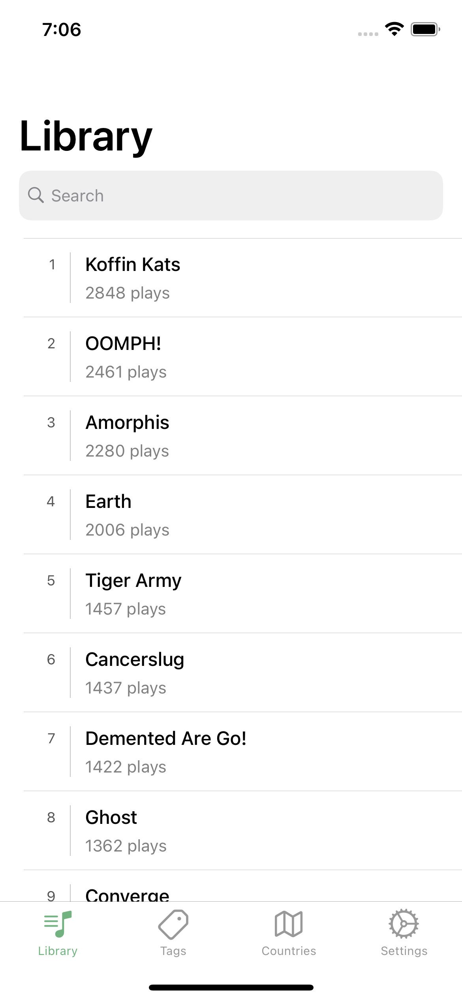
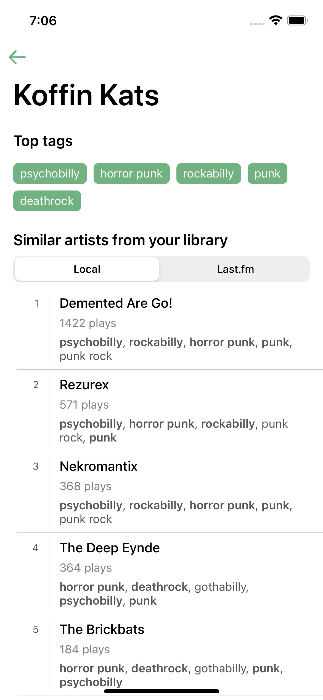
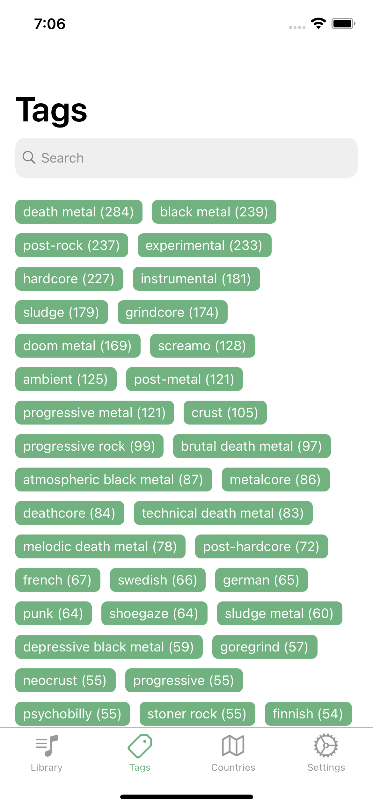
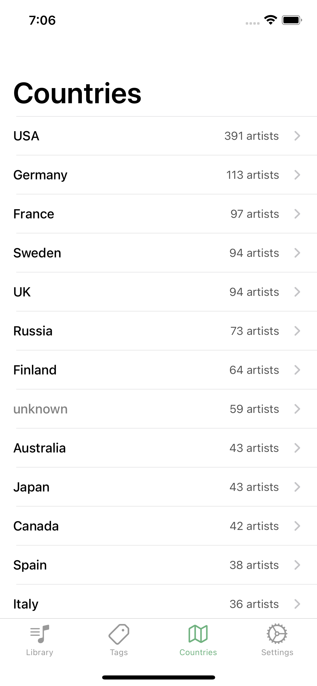

# MementoFM
 
Have you ever tried to find a music band which is similar to the one you're currently listening to? What if you had already listened to many of those _before_? Trying to recall the exact artists can become a real problem when your music library is vast. If you're an avid [Last.fm](https://www.last.fm/) user, MementoFM is here to help you.

**Features:**

* Browse and search your Last.fm library
* Find similar artists based on tag intersection
* Search artists by tag
* Browse artists by country
* Setup tags which will be ignored during similarity check (e.g. too broad ones or irrelevant to the actual music content) 

## Screenshots
   

(Originally there were also photos of the artists but then Last.fm started to return placeholders instead of actual photos. Turns out they don't allow to use those photos anymore.)

## Mint

[Mint](https://github.com/yonaskolb/Mint) is used to install dependencies like SwiftLint:
```
$ mint bootstrap --link
```

## Running the app
You'll need a Last.fm API key in order to run this app. Here's how you obtain it:

1. Create a regular user account on [Last.fm](https://www.last.fm/).
2. Create an API account on [http://www.last.fm/api/account/create](http://www.last.fm/api/account/create). 
3. Find the `Keys.example.swift` file in `Sources/Application/` and rename it to `Keys.swift`. Use the API key from the previous step to replace the `YOUR_API_KEY` placeholder.
